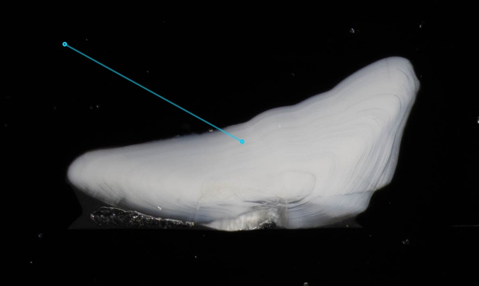
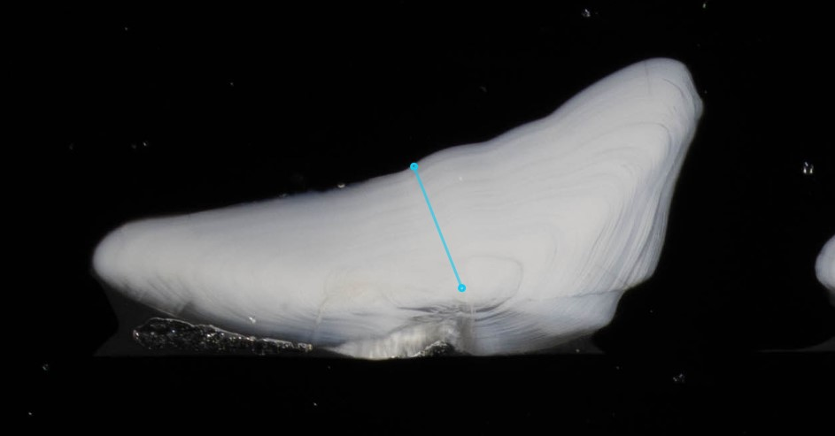
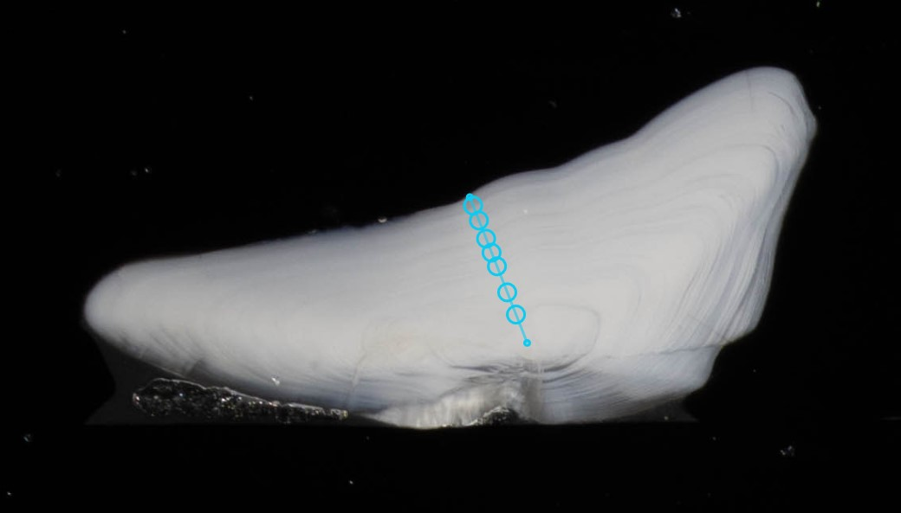

Viewing & editing annotations
=============================

There are 2 ways to get to the photolith annotation editor:

* Via :ref:`projects:Projects`, if you are part of an open project you can add annotations
* As :ref:`administration/users:General annotations`, if you are a general annotator you can add annotations to any otolith

Once you have opened the annotator, you can switch between individuals within your project or search using the bar at the top of the page.
Different modes are available by selecting the tabs below.

The "full view" button on the right of the tab bar hides the bottom half of the screen, allowing a full view of the individual to annotate.

Individual Metadata
-------------------

Lets you view all metadata held for this indivdual

Existing Annotations
--------------------

Here you can view previous annotations, if allowed (you are not allowed to view other annotations when viewing an open project).
All existing annotations will be visible on screen, with a color legend along the side of the table.

You can view a single annotation by clicking on it, this will also allow you to:

Copy full annotation
    Copy the entire annotation into the *Annotate* tab, for editing
Copy line only
    Copy just the start and end points into the *Annotate* tab, so your annotation can be based on the same axis
Delete annotation
    If the annotation was your own, you can also delete it

You can also view multiple annotations at the same time by clicking on each one you want to view. They will then be displayed in different colors with a color legend by each annotation.
To deselect any chosen annotation, you click them again.

Annotate
--------

When in the *Annotate* tab, a blue axis line will be visible on the image. 

.. _figure-axis-line-first:

To annotate:

* Drag the end points of the axis to the centre & edge of the otolith in the direction you want to annotate.

.. _figure-axis-line-moved:

* Double-click anywhere on the axis to add an annuli marker.

.. _figure-axis-line-annotations:

* Double-click an existing marker to remove it.
* Drag existing markers to change their position on the axis line.
* Drag annotations away from the axis line by holding ``Ctrl`` and dragging.

You can zoom into the image using the scroll-wheel, or pinching.
The image enhancement controls in the top-right menu allow you to adjust for a clearer view.

By default, markers will be added along the existing axis. If you want marks away from the axis, hold down ``Ctrl``:

* ``Ctrl`` double click to create a marker anywhere (rather than the nearest point along the axis).
* ``Ctrl`` drag to move a marker anywhere.

Before saving, the form below also needs filling in:

Age reading
    Your final age reading, by default populated by number of annuli but can be edited.
Image rating
    A rating for how easy the age reading was.
Reader authority
    How highly regarded your reading will be. This mostly depends on if you are one of the :ref:`administration/users:Species Experts` for the current species. Here we also take into account if you have only access to the image or if you have the otolith and/or slide at hand to clarify the age readings.
Comments
    Any other comments you may have.

Once done, press *Save* and then *Next >* in the individual selection bar at the top of the page.
