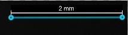
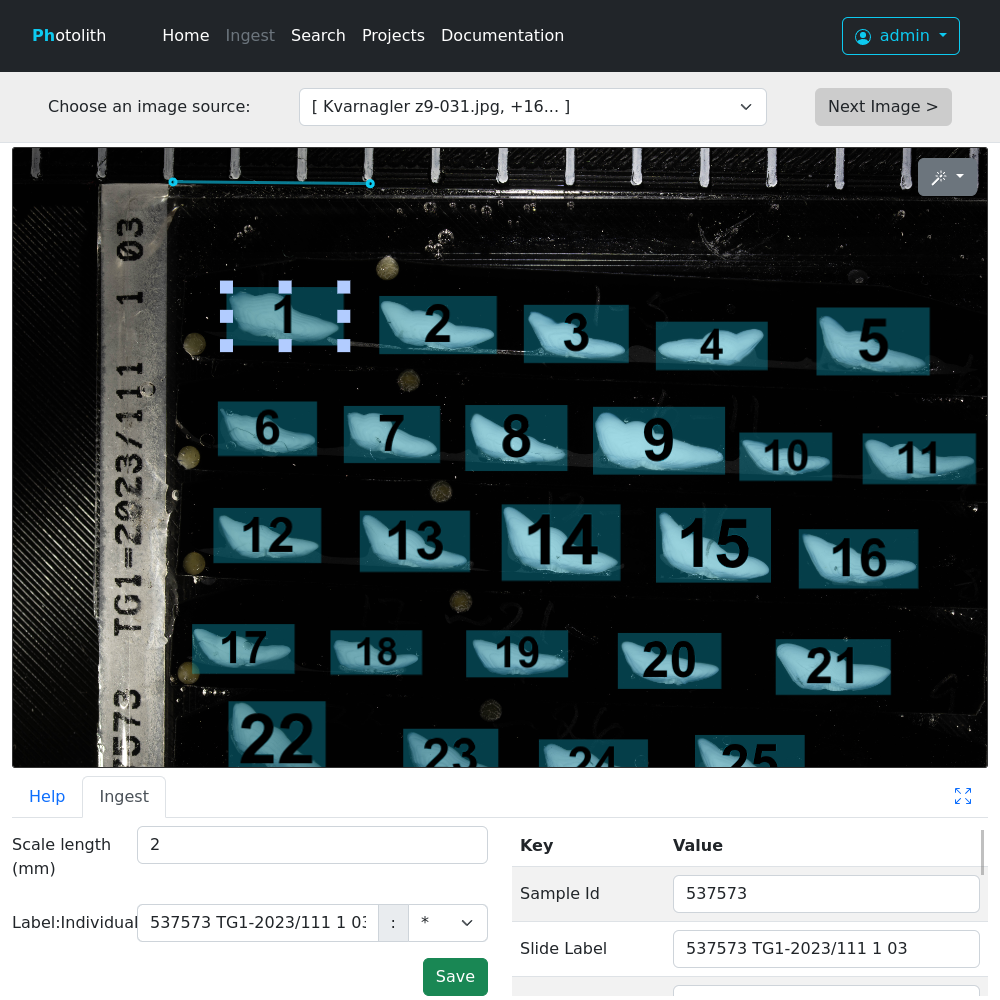

Image Ingest: Adding images to Photolith
========================================

To have access to the ingest section, you need to be added to the "Ingest" group, if you are a site administrator, see :ref:`administration/users:Ingest/Upload new images` for how to add this.

The `image ingest page can be found here </ingest/>`_

Selecting an image source
-------------------------

Firstly, choose an image source using the drop-down next to *Choose an image source:*

* **Uploaded by ...**: View images that have been uploaded directly to Photolith (see :ref:`administration/camera:Configuring a camera for direct upload`)
* **Upload files from computer**: Select images stored on your computer. Multiple images can be selected in one go by holding Ctrl
* **Take Photo**: Take photo using a webcam or USB microscope attached to your computer. You will see a live view, which you can then click to take a photo

    * If you have more than one camera attached, you will be able to select which camera from the drop-down, but only after first selecting to take a photo with the default camera

The photolith image viewer allows you to pan by dragging the image with either left or right mouse button,
and zoom in & out with the scrollwheel or pinching.
Various image effects can be activated by pressing the magic wand icon in the top right.

Setting image scale
-------------------

On loading an image, there will be a short blue line in the top-left side of the image. This is the scale marker.

Drag the handles on each end so that they sit over the scale marker in the image, and enter the corresponding distance in mm in the *Scale length* box.

.. _figure-scale-bar:

If the image has no scale, then set the *Scale length* box blank.

Marking up individuals
----------------------

Next, you need to fill in the *Label* text-box with a slide or image label for this image.
Once a value is entered, photolith will attempt to fetch metadata on the image automatically, see the help to the right for information on label formats it recognises.
If no data can be found, then photolith will prompt you to say how many individuals are in the current image.

Now this is done, there will be a set of boxes on top of the image.
These should be positioned on top of each individual.

.. _figure-ingest-overview:

* Click on a box to select it, and then use the handles around the edge to resize it
* You can use Ctrl-drag to select multiple boxes, and drag/resize them as a group

The label may be used for multiple images, in which case not all the individuals will be part of the image.
You can either:

* Drag individuals that aren't part of this image to the hatched area outside, they will not be saved
* Use the right mouse button to drag the image, even when over indivduals (this is useful when there is one individual covering the entire image)
* Select a single individual using the drop-down to the right of the *Label* text-box. All other individuals will be removed

Adding metadata to individuals
------------------------------

When an individual is selected, a table will appear in the lower half of the screen with metadata.
Use this to either check that information was retrieved from the API correctly, or to add metadata manually.

* Use the *Add...* drop-down at the bottom to add further fields
* Edit individual fields

If you need to add values for multiple individuals, for instance Species, fill in metadata for the first inidividual then press *Copy to all individuals*.
This will copy metadata from the current individual to all other individuals, provided they don't already have a value.

Saving
------

Once all individuals have been marked up on the image & have metadata, press *Save*. You can then advance to the next available image with *Next Image >*.
