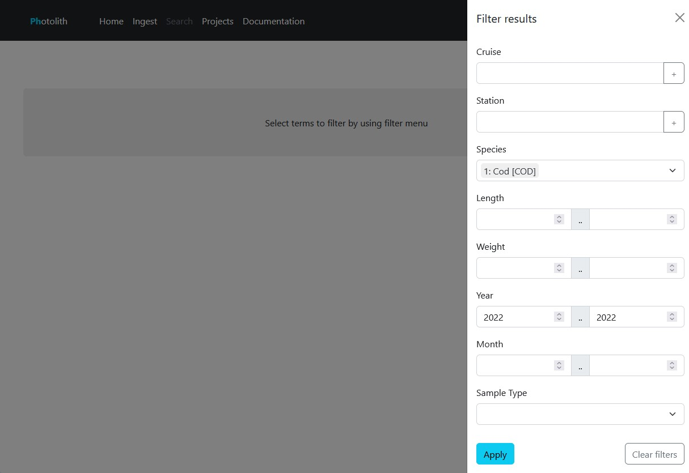
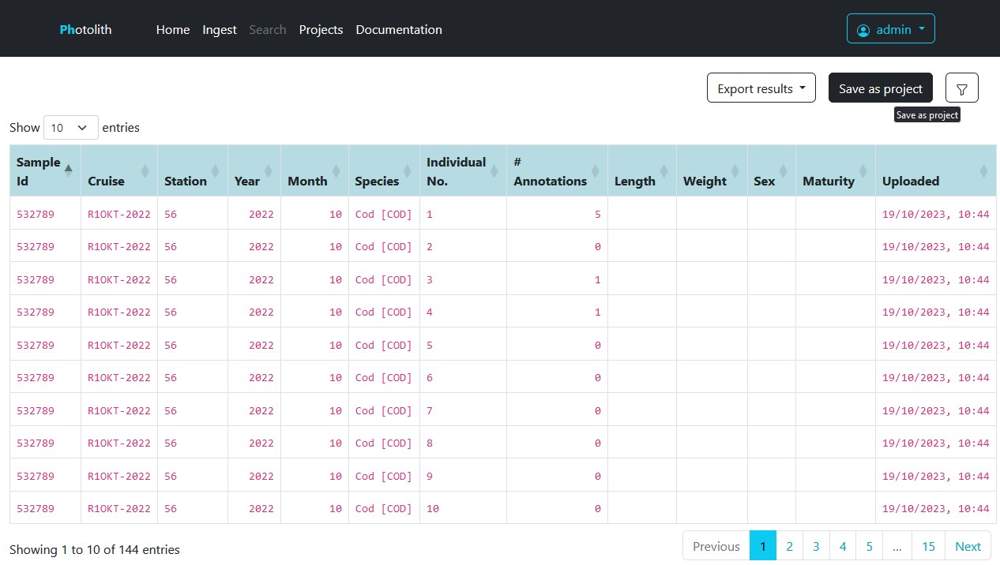
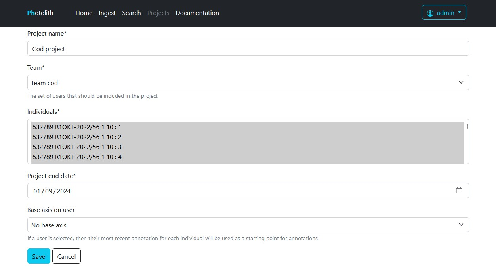
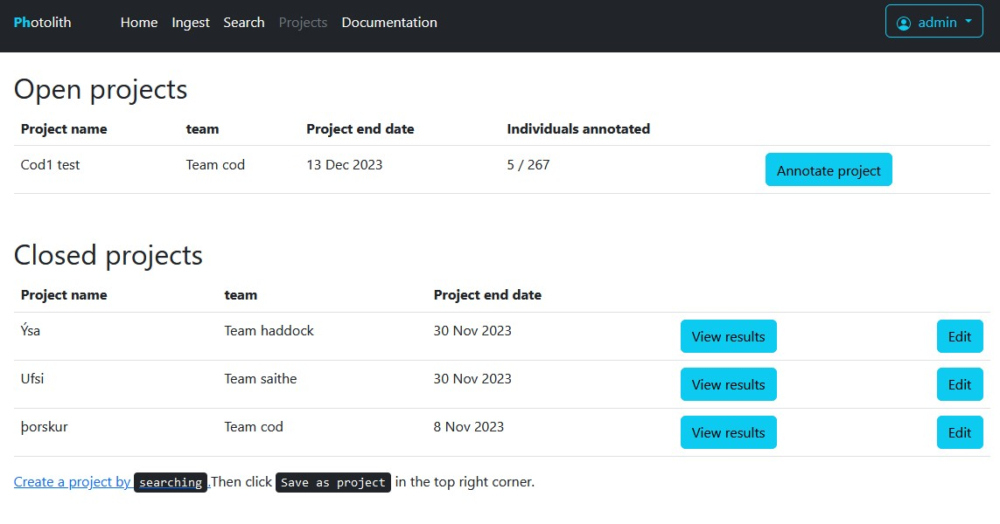
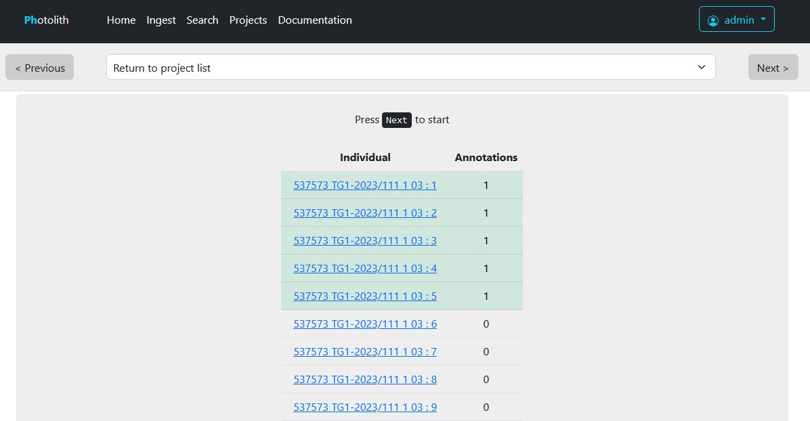
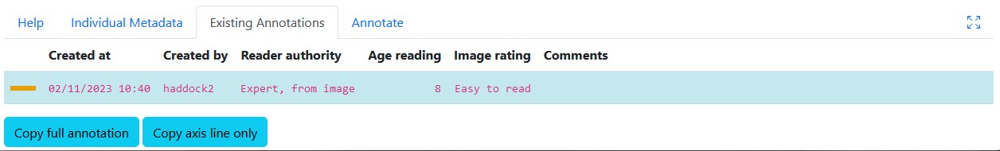
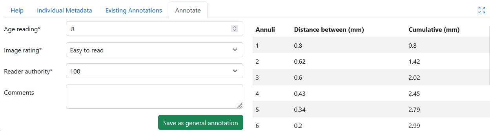

Projects
========

In the project tab you will always see projects that are available to you. 
If you are part of a team, you can see the project that is meant for your team.

Creating projects
---------------------------------------------

To create a project, go to the :kbd:`Search` tab and use the filter to search for the relevant information needed for the project.
You can search for specific species, years, cruises etc.

.. _figure-filters:

Once you have searched for the needed information you will see a list of otoliths. To save this as a project, click :kbd:`Save as project` in the top right corner of the search window.

.. _figure-filter-save-as-project:

There you will need to give the project a name, assign what team can participate in the project and choose an end date.
If there are already existing annotations on these individuals, you can also choose to always add the axis used in the previous age reading by the specific age reader that is chosen from the list. 
This can be useful if you want to have every age reader follow the same axis line.

.. _figure-create-project:

Participating in projects
---------------------------------------------

Once you are a part of a project, you will see all active projects in both the :kbd: 'Home' and :kbd: 'Project' tabs. In the :kbd: 'Project' tab you see both active and inactive projects that your team/teams is part of.

.. _figure-project-view:

Once you click on a project you will see a list of otoliths in the project and labels if they have annotations or not. 
If you are starting to annotate a project for the first time you can click the :kbd:`Next` button on the top of the page to get to the first individual to annotate.
If you have already annotated some otoliths in the project and are coming back to it, you can scroll the list of otoliths and click on the first one that has 0 annotations.

.. _figure-project-active:

Once you see the image, you can also see your own previous annotations in the :kbd:`Existing annotations` tab but not anyone elses. 
If you want to delete a previous annotation made by you within the project, you can click it in the :kbd:`Existing annotations` tab and press :kbd:`Delete annotation`.

Exporting annotations out of a closed project
---------------------------------------------

Once a project is closed, annotations can be copied out of a project. You can also use chosen annotations from the project to add to general annotations:

* Go to the projects list page
* Press :kbd:`View results` on the relevant project
* Open the first annotation, and press :kbd:`View/add annotation`
* Select the most representative annotation from existing annotations, and press :kbd:`Copy full annotations`

.. _figure-copy-annotation:

* Make any changes if necessary, and press :kbd:`Save as general annotation`

.. _figure-save-annotation:

* Press :kbd:`Next` to move on to the next individual.
